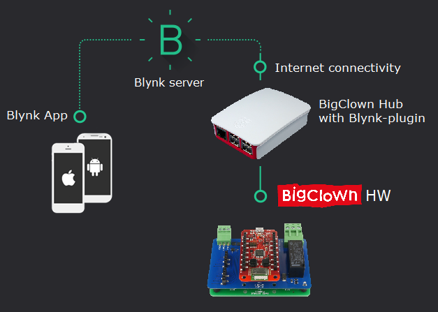
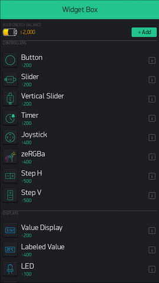

# Blynk - Ovládej BigClowna z mobilu

<!-- toc -->

V tomto návodu si ukážeme, jak napojit BigClowní prvky na mobilní aplikaci Blynk.
Blynk ti umožní ovládat všechny funkce pohodlně ze smartphonu nebo tabletu pomocí grafických widgetů. Tlačítkem tak bůdeš schopen přepnout relé nebo rozsvítit LED pásek, sliderem měnit intenzitu a odstín světla, pomocí grafu zobrazit hodntoty teploty i dalších veličin.

   
   
## Jak funguje Blynk

Blynk není jen mobilní aplikace, ale také IoT cloud server, která ti umožní ovládat nebo číst data ze senzorů v mobilu odkudkoliv s připojením k internetu.
Stačí se přihlásit pod uživatelským účtem.
Stanice Bigclown si vyměňuje data se serverem i když není mobilní aplikace připojena.
V aplikaci tak lze např. zobrazit historii naměřené teploty za poslední týden nebo nastavit časový spínač na stanovenou hodinu.
Blynk nabízí ale i "offline" možnost, nainstalovat si server lokálně.
Sami jsme ale byli překvapení, jak rychlá je odezva při sepnutí relé i při připojení přes vzdálený server.
Zpoždění je při bežném internetovém připojení takřka nepostřehnutelné.
Více o Blynku lze nalézt v [dokumentaci](http://docs.blynk.cc/).

   

## Potřebné SW/HW vybavení
* telefon s OS Android 4.0.3 a vyšší nebo iOS 8.0 a vyšší
* minimálně jednu pevnou stanici BigClown tvořenou Core Modulem a dalšími prvky, připojenou k Raspberry Pi nebo jinému Lunuxovému počítači s nainstalovaným SW BigClown Hub.
* další stanice (Nody) již mohou být bezdrátové

Podrobný postup zapojení prvků BigClown je popsán ve vzorovém projektu [Smart LED Strip](https://doc.bigclown.cz/smart-led-strip.html).
Kompletní sadu lze také zakoupit ve [zvýhodněném setu](https://obchod.bigclown.cz/products/smart-led-strip-set).
Tento návod tedy doplňuje vzorový projekt Smart LED strip, slouží ale také jako obecný návod pro všechny ostatní projekty s Blynkem.

## Instalace a založení účtu v programu Blynk

1. Nainstaluj Blynk na svoje zařízení (aplikace je dostupná na Google Play a App Store).
2. Spusť Blynk.
3. Vytvoř si uživatelský účet (Create New Account).

## Vytvoření Blynk projektu

4. Vytvoř nový projekt:

   

5. Zvol název projektu (Project Name) a jako HW Generic Board, způsob komunikace a stiskni *Create*.

   

6. Spárování projektu se BigClown Hubem
Každý projekt v Blynk je indetifikován tzv. 

## Přidávání widgetů v Blynku

Každý vložený prvek (widget) v Blynku “stojí” nějakou energii, po zaregistrování a přihlášení do aplikace je k dispozici zdarma 2000 bodů, což postačí na přidání většiny potřebných funkcí pro základní projekty s prvky typu tlačítko nebo slidery.
Pokud budeš chtít vytvořit větší projekty s mnoha prvky a využít užitečné funkce jako graf historie pro sledování hodnot ze senzorů, doporučujeme dobít si další energii.
Výhodou je, že volná i zakoupená energie se po odstraněním prvku nebo celého projektu vrací a zároveň ji lze využít nezávisle na platformě (Android, IOS) souběžně na více zařízeních.
Stačí se jen přihlásit pod svým uživatelským účtem.
Pozor, za widgety, které přidáte na pracovní plochu telefonu se energie po jejich odstranění nevrací!

   

## Tlačítko

   

Widget Button se hodí pro ovládání relé spínání LED pásku nebo aktivaci různých funkcí.
Tlačítko přidej dotykem na prázdnou plochu v Blynk projektu (popř. ikonou *+Add*). 
nastavení tlačítka nebo jiného libovolného widgetu vstoupíš dotykem na něj. 
Lze nastavit, popis, mapování výstupu (viz níže), logické hodnoty (typicky 0 / 1), dále logiku (PUSH generuje pouze pulz, SWITCH trvale drží stav).
Lze také zmenit barvu tlačítka a popisky pro stavy *ON* / *OFF*

   
      

## Napojení widgetu na prvky BigClown
Na tlačítku si ukážeme propojení widgetu s moduly BigClown
Spojení mezi Blynkem jednotlivými prvky obstárává blynk-plugin který je součástí linuxových komponent nazvaných BigClown Hub.
Výstup (OUTPUT) lze namapovat na tzv. *Virtual pin* *V0* až *V99*. virtuálních pinů), 
ve výchozím stavu jsou nastaveny Virtuální Piny následovně:

### Výchozí mapování Virtul PINů Blynku s BigClown Blynk-pluginem:

| Virtual PIN | Popis                                        | Rozsah         | Jednotka |
|:-----------:| -------------------------------------------- |:--------------:|:--------:|
| 0           | senzor teploty                               | -40 až 125     | °C       |
| 1           | senzor relativní vlhkosti                    | 0 až 100       | %        |
| 2           | intenzita světla LED pásku                   | 0 až 1023*     |          |
| 3           | zapnutí / vypnutí LED pásku                  | 1 / 0          |          |
| 4           | zapnutí / vypnutí relé                       | 1 / 0          |          |
| 5           | zeRGBa, volba barvy                          | 0 až 1023*     |          |
| 6           | Widget Menu: nastavení režimu LED pásku (1)  | 1, 2, 3, 4     |          |
| 7           | ovládání bílé složky LED pásku               | color          |          |
| 8-20        | uživatelské předvolby pro tlačítka (2)       | color          |          |

(1) 1 = rules, 2 = color, 3 = compound, 4 = framebuffer)

(2) Přiřazené funkce se konfigurují pomocí souboru *etc/bigclown/plugin/led-strip.user*

## Spojení Blynk projektu s BigClownem

Pro jednoznačnou identifikaci Blynk projektu slouží tzv. autorizační token.
Pro navázání komunikace mezi Blynk projektem a Raspberry Pi, kde běží BigClown Hub, je nutné token nastavit:

1. Vstup do nastavení projektu (Ikona matky v horním menu):

   

2. Nech si poslat autorizační token na email.
   Budou-li se zasláním emailu potíže, zkopírujte token do schránky (ikona “Copy all”) a následně si jej pošli např. emailem ručně:

   

3. Připoj se k Raspberry Pi a nastav autorizační token pomocí MQTT příkazu:
   ...   
   mosquitto_pub -t "plugin/blynk/config/set" -m '{"token":"your_token"}' -r
   ...
   
   **Pozor** závorky uvozující autorizační token jsou součástí příkazu:

  

  Pozn. parametr -r (remain) v MQTT zaručí, že se nastavení uchová i po restartu Raspberry P

4. Spusť projekt a vyzkoušej funkci tlačítka!

  

5. Pro přidání dalších prvků zastav běžící Blynk projekt.

  

### První pomoc
Pokud se po spuštění projektu Blynk vypíše hlášku “Device is offline” zkontroluj:
* Připojení k internetu svého telefonu nebo tabletu.
* Připojení Raspberry Pi k internetu.
* Zda jsi zadal správný autorizační token

## Slider a Step

  
  

Pro regulaci hodnoty ve vetším rozsahu (např. změna intenzity světla), lze vyžít widget *Slider* nebo *Step H/V* pro inkrementální hodnot pomocí  tlačítek +/-.

      

 
## ZeRGBa 

  

Widget zeRGBa je ideální pro ovládání RGB složek vícebarevných LED pásků.
Pro napojení na adressovatelný RGB pásek zvolte v nastavení volbu MERGE a namapujte jej na Virtual PIN 5.
Doporučuji vypnout volbu *SEND ON RELEASE* (poté je změna barev obnovována průběžně při pohybu po ploše zebry). 

Poznámka: Rozsahy hodnot zůstávají výchozí 0 až 1023 (ve blynk-pluginu jsou tyto hodnoty přepočítány na 00 až ff hexa).
 
  

## Menu

  

Prvek Menu může sloužit pro výběr předvoleb. Ve vzorovém projektu [Smart LED Strip](https://doc.bigclown.cz/smart-led-strip.html) je 
Menu použito pro výběr režimů LED pásku.

  

## Value Display a Labeled Value

  

Pro sledování aktuálních hodnot ze senzorů lze použít prvek Value Display nebo Labeled Value (stojí více energie, ale zobrazuje za hodnotou i nastavenou jednotku).
Mezi základní nastavení patří název, barva okna, rozsah hodnot. 
Frekvenci čtení nastav na PUSH (obnovení hodnoty při obdržení zprávy).

  
