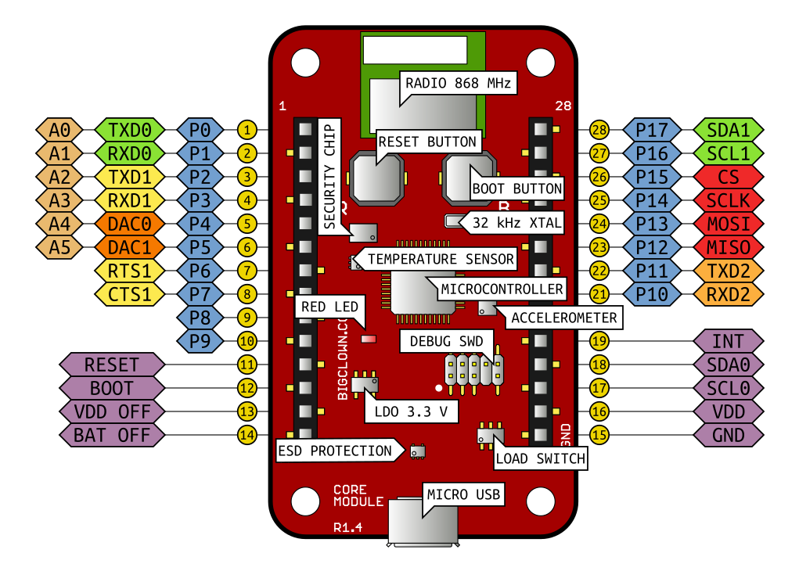

# Core Module Hardware

Tady ti naši grafici připravili přehled pojmenování pinů a znázornění základních bloků.
Popis pinů budeš potřebovat, pokud budeš zapojovat nějaké vlastní externí senzory a součástky.
Pokud budeš používat tagy a moduly, tak ty mají v SDK své vlastní piny a nemusíš se o ně starat.

Piny ožnačené jako **Px** jsou zapojeny pouze k mikrokontroléru.
Nejsou připojené k žádným periferiím a jsou tedy k dispozici pro tvoji aplikaci.

## Mapování GPIO pinů

V následující tabulce je popis pinů a periferií mikrokontroléru  [STM32L083CZ](http://www.st.com/en/microcontrollers/stm32l083cz.html):

| Pin | Signál     | MCU Pin      | 5 V Tolerant  |
| --- | :--------- | :----------- | :----------- |
|   1 | P0/A0/TXD0 | PA0  (10)    | -            |
|   2 | P1/A1/RXD0 | PA1  (11)    | Ano          |
|   3 | P2/A2/TXD1 | PA2  (12)    | Ano          |
|   4 | P3/A3/RXD1 | PA3  (13)    | Ano          |
|   5 | P4/A4/DAC0 | PA4  (14)    | -            |
|   6 | P5/A5/DAC1 | PA5  (15)    | -            |
|   7 | P6/RTS1    | PB1  (19)    | Ano          |
|   8 | P7/CTS1    | PA6  (16)    | Ano          |
|   9 | P8         | PB0  (18)    | Ano          |
|  10 | P9         | PB2  (20)    | Ano          |
|  21 | P10/RXD2   | PA10 (31)    | Ano          |
|  22 | P11/TXD2   | PA9  (30)    | Ano          |
|  23 | P12/MISO   | PB14 (27)    | Ano          |
|  24 | P13/MOSI   | PB15 (28)    | Ano          |
|  25 | P14/SCLK   | PB13 (26)    | Ano          |
|  26 | P15/CS     | PB12 (25)    | Ano          |
|  27 | P16/SCL1   | PB8  (45)    | Ano          |
|  28 | P17/SDA1   | PB9  (46)    | Ano          |

Pro jednotlivé GPIO piny platí následující omezení:

* Maximální proud na jeden GPIO pin je 16 mA.
* Maximální součet proudů všech GPIO je 90 mA.

## Schéma hardwaru

Kompletní schéma Core Module je [ke stažení v PDF](https://github.com/bigclownlabs/bc-hardware/raw/master/out/bc-module-core/bc-module-core-rev-1-3-sch.pdf) nebo v Eagle návrhovém systému na našem [GitHubu](https://github.com/bigclownlabs/).
