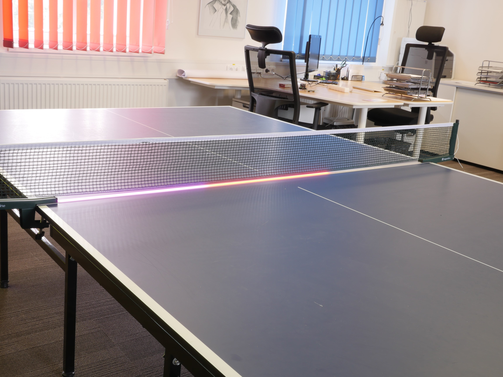
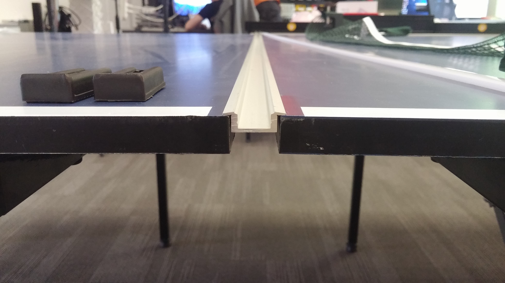
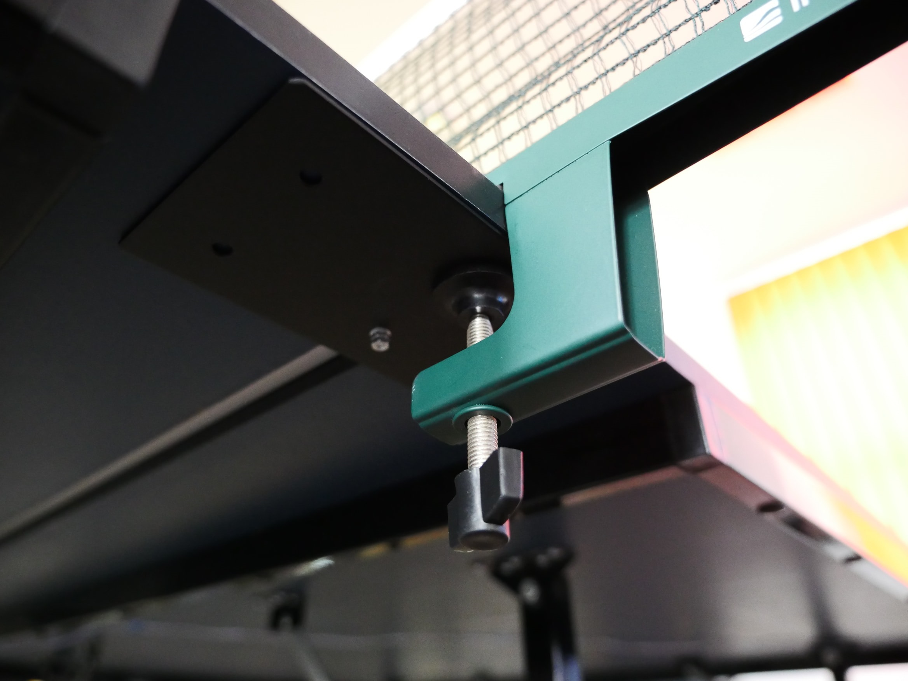
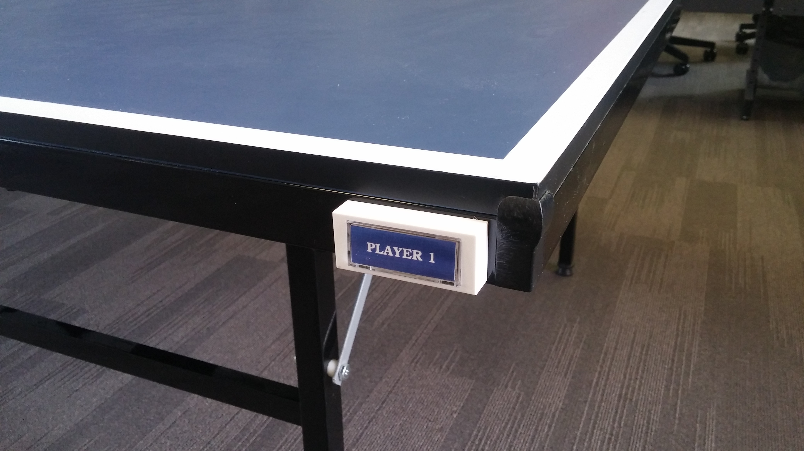
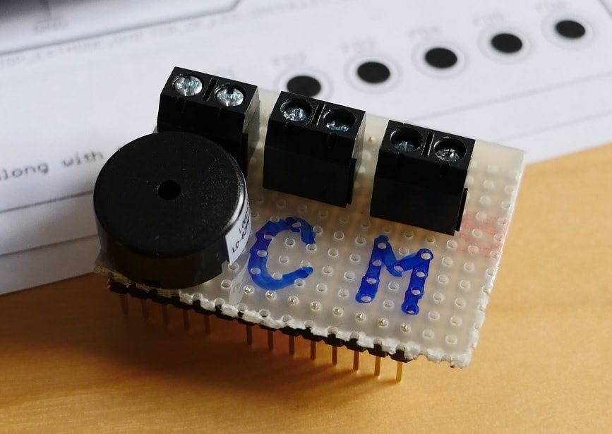
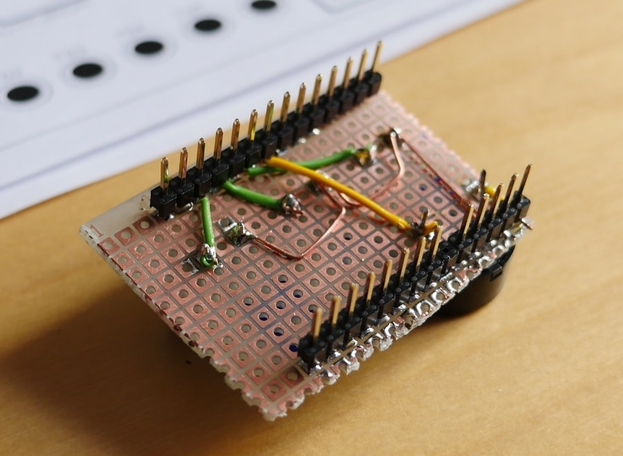
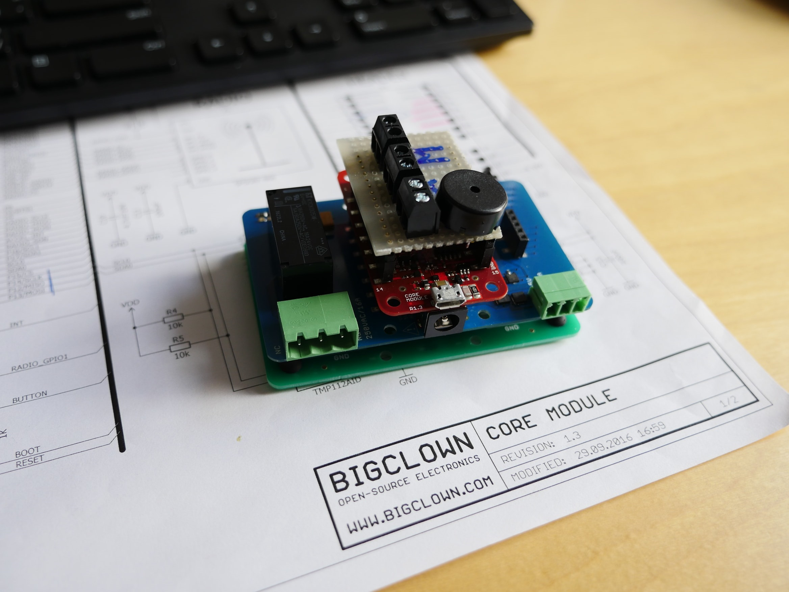
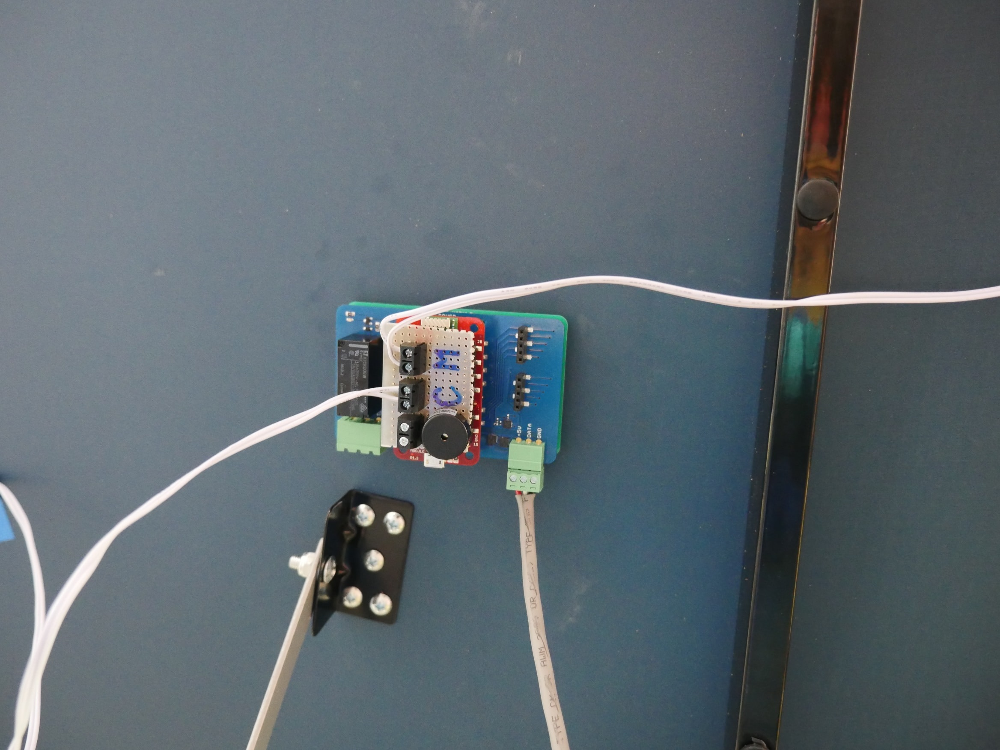

# Ping-pong

## O čem projekt je a co ti přinese

 Velmi jednoduchý projekt, který velice originálně řeší problémy s počítáním bodů při hraní stopního tenisu. V podstatě se jedná o počítadlo na body, které se inkrementuje pokaždé. Když jeden, nebo druhý hráč získá bod a po dosažení 21 bodů oznámí vítěze. Výsledkem je unikátní pingpongový stůl, který vždy dokáže minimálně rozproudit konverzaci návštěvníků v našich kancelářích, protože je jediný svého druhu… zatím.

 
 (na obrázku je první verze, později byly přidány oddělovací prvky mezi body)


## Co všechno k projektu potřebuješ

* 1x LED pásek
* 1x Core Module
* 1x Power Module
* 1x Base Module

Dále budeš potřebovat:

* PC nebo notebook s Windows, MacOS nebo Linux
* Napájecí adaptér
* Tlačítka
* Pár metrů vodičů (ideálně dvou-žilové zvonkové kabely)
* Kousek cuprextitu
* Svorkovnice
* 2x 14ti-pinovou lištu
* plechy pro ukotvení

## Jak na to

### Příprava stolu :

Mechanika celého problému by se dala shrnout asi tak, že výrobce stolu snad počítal s tím, že se tam bude pásek instalovat, jelikož byl celý zákrok neinvazivní, ale výsledek je i přesto velice robustní. Zápustný hliníkový profil perfektně zapadne do mezery mezi polovinami stolu.

 1. Zápustný ALU profil se seřízne přesně na šířku stolu.

 

 2. Vyvrtají se do něj dvě díry, pro šroub se zápustnou hlavou, na stranách a jedna uprostřed, tak aby bylo možné na spodní stranu stolu přiložit plechy pro ukotvení. Jejich přesná velikost není nijak kritická. Je možné hned připevnit i rychloupínací držáky.

 

 3. Nakonec se, pomocí tafixu, připevní tlačítka s kabelem dostatečné délky po stranách.

 

### Složení stavebnice
 1. Zbastlení „svorkovnicového modulu“

 


 

2. <a href="https://github.com/bigclownlabs/doc.bigclown.cz/raw/ping-pong/docs/images/ping-pong/ppv0_1.bin"> Stáhnout firmware
</a> viz. dole

3. <a href="https://doc.bigclown.cz/core-module-flashing.html"> Flashnutí Core Modulu pomocí dfu
</a> a sestavení.

 

### Instalace
 1. Sestavu přitafixuj ze spodní strany stolu, tak aby jsi k němu dosáhl vodiči od tlačítek a na kabel k LED pásku.

 2. Zapoj zvonková tlačítka a kabel k LED pásku.

 

## Rozšíření

Další integrace jsou alternativou, díky  Raspberry PI s odpovídajícím programem v pythonu, se lze poměrně lehce připojit k internetu (např. se připojit k HUE a měnit barvu svícení podle současného stavu počítadla).

## Firmware

### Binary
 * <a href="https://github.com/bigclownlabs/doc.bigclown.cz/raw/ping-pong/docs/images/ping-pong/ppv0_0.bin"> download ping-pong v0.0 binary
</a>

 * <a href="https://github.com/bigclownlabs/doc.bigclown.cz/raw/ping-pong/docs/images/ping-pong/ppv0_1.bin"> download ping-pong v0.1 binary
</a>

### Inicializace

Jak se vidět v následující ukázce inicializace se, díky přístupu, kterému by se dalo říkat event-callback, vejde na pár řádků a přesto je velice transparentní.

```
void application_init(void)
{
    // Initialize power module with led strip
    bc_module_power_init();
    bc_led_strip_init(&led_strip, bc_module_power_get_led_strip_driver(), &_led_strip_buffer_rgbw_205);

    // Initialize red button
    bc_button_init(&button_red, BC_GPIO_P3, BC_GPIO_PULL_DOWN, false);
    bc_button_set_event_handler(&button_red, button_red_event_handler, NULL);

    // Initialize blue button
    bc_button_init(&button_blue, BC_GPIO_P2, BC_GPIO_PULL_DOWN, false);
    bc_button_set_event_handler(&button_blue, button_blue_event_handler, NULL);

    // Initialize piezo gpio pin
    bc_gpio_init(BC_GPIO_P5);
    bc_gpio_set_mode(BC_GPIO_P5, BC_GPIO_MODE_OUTPUT);

    // Initialize reset task and execute it one time
    reset_task_id = bc_scheduler_register(reset, NULL, BC_TICK_INFINITY);
    reset();
}
```

### Příprava costume bufferu pro LED pásek

Jelikož se v minimálním množství ping-pongových stolů bude jednat o pásek standartní délky (144 diod) je potřeba si připravit speciální buffer pro LED pásek. V mém případě to byl pásek RGBW, délky 204 diod.

```
static uint32_t _dma_buffer_rgb_204[LED_COUNT * sizeof(uint32_t) * 2];

const bc_led_strip_buffer_t _led_strip_buffer_rgbw_204 =
{
    .type = BC_LED_STRIP_TYPE_RGBW,
    .count = LED_COUNT,
    .buffer = _dma_buffer_rgb_204
};
```

### Obsluha piezo reproduktoru

Snad jediná věc, kterou bylo potřeba samostatně implementovat.

```
// Dummy piezo implementation
static unsigned int I = 100, J = 400;

void piezo()
{
    unsigned int i, j;

    for (i = 0; i < I; i++)
    {
        for (j = 0; j < J; j++);
        bc_gpio_set_output(BC_GPIO_P5, true);
        for (j = 0; j < J; j++);
        bc_gpio_set_output(BC_GPIO_P5, false);
    }
}
```
